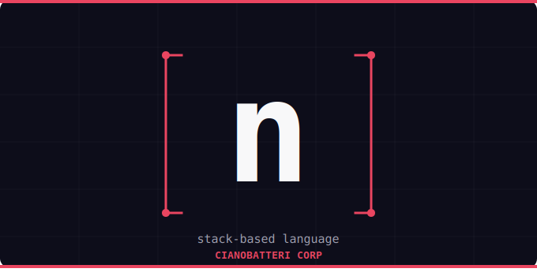

<div align="center">
  

# n — a stack-based language

**n** is a simple stack-based interpreted language written in Java.

</div>

---

## Getting started

Make sure you have Java installed, then run:

```bash
build.bat
```

---

## Usage

Type expressions directly into the prompt. Values are pushed onto the stack, and operations consume them.

```
Enter your code: 5 3 + .
> 8
```

---

## Operations

| Token | Description |
|-------|-------------|
| `123` | Push a number onto the stack |
| `+` | Add top two numbers |
| `-` | Subtract top two numbers |
| `*` | Multiply top two numbers |
| `/` | Divide top two numbers |
| `.` | Pop and print the top of the stack |
| `dup` | Duplicate the top of the stack |
| `dump` | Print the entire stack |
| `exit` | Exit the interpreter |

---

## Examples

```
5 5 + .         → 10
10 3 - .        → 7
4 dup * .       → 16
2 3 + 4 * .     → 20
dump            → prints current stack
```

---

<div align="center">
  <sub>made with ❤️ by <strong>Cianobatteri Corp</strong></sub>
</div>
